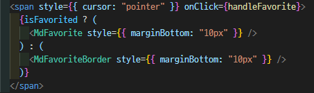

# favorited

태그: 로직

## 1. UI 구현

- 평상시에는 빈 하트 클릭시 꽉찬 하트여야 한다.
- useState를 사용하여 `const [isFavorited, setIsFavorited] = useState(false);` 라고 정의

## 2. Favorite 버튼 onClick 시 정보 데이터베이스에 넣기

- Already Favorited → user collection에서 제거
- is Not Favorited → user collection에 추가
- 클릭을 한 유저 안의 favorited라는 데이터를 따로 만들기

## 3. 새로고침해도 Favorited가 남아있게 하기

- useEffect 등록
- listener을 만들어 이를 통해 데이터 베이스 안에 있는 것은 한 번 정보를 가져온다
  - 이때 firebase once method를 사용 → 9버전 [onValue](https://firebase.google.com/docs/database/web/lists-of-data?hl=ko)
- favorited 안에 데이터를 순회하여 배열로 반환한다. 그 배열을 chatRoomIds 상수로 선언.
  - 이때 [Object.keys](https://developer.mozilla.org/ko/docs/Web/JavaScript/Reference/Global_Objects/Object/keys) 사용
- 현재 보여지는 currentChatRoomId가 chatRoomIds의 배열 안에 들어 있으면 true , 없으면 false 이 값은 isAlreadyFavorited 에 저장
  - 이때 배열이 특정 요소를 포함하고 있는지 판별하는 [includes](https://developer.mozilla.org/ko/docs/Web/JavaScript/Reference/Global_Objects/Array/includes)로 사용
  - includes는 string과 Array에서 사용 가능하다.

## 4. Favorited 채팅방 클릭시 해당 방으로 이동

## 5. Favorited를 위한 리스너 제거하기
