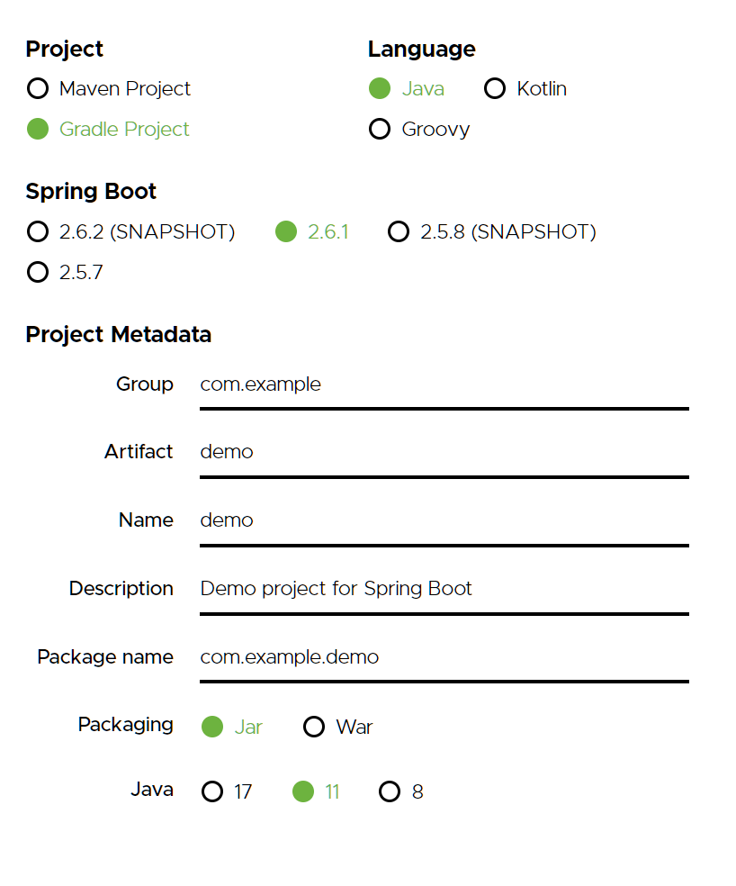

# 1 프로젝트 생성

생성일: 2021년 12월 21일 오후 2:20

## 프로젝트 생성하는 방법

1. java 설치
2. Intellij나 이클립스 설치한다.
3. [https://start.spring.io/](https://start.spring.io/) \*\*\*\*에서 스타터 다운



- 요즘은 Gradle로 제작함
- maven 과 gradle 차이
  - maven


- dependencies에서는 spring Web과 HTML 템플릿을 만들어주는 thymeleaf를 설치한다.


- 요즘은 이런 방식으로 src가 main과 test로 분화되어 있다.
- 테스트는 테스트 코드드로가 관련된 소스가 들어간다. 테스트 코드가 요즘 개발 트렌드에서 매우 중요하다.


- 버전과 들어간 플러그인 확이 가능. 어 왜 11버전이지 나 정보 보니까 8 버전이었는데 모르겠네


```
public static void main(String[] args) {
   SpringApplication.run(HelloSpringApplication.class, args);
}

```

를 런 하면 톰캣이 서버를 열었다는 로그가 뜬다.


이 때 로컬 호스트 포트 번호로 들어가면 에러코드가 뜨는데 이러면 성공이다.

서버를 끄면 들어갈 수도 없기 때문이다.

톰캣이라는 웹서버를 내장하고 있어서.

인텔리제이를 쓰면 요즘은 그래들을 통해서 실행될 때가 있다.


- 설정창 여는 단축키는 ctrl+ alt + s이다.


- 이걸 다 인텔리제이로 바꿔준다. 이유는 그래들을 통해서 서버를 띄우면 오래 걸리기 때문이다.
