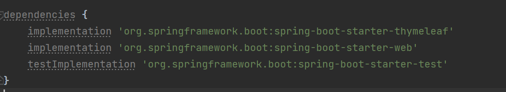
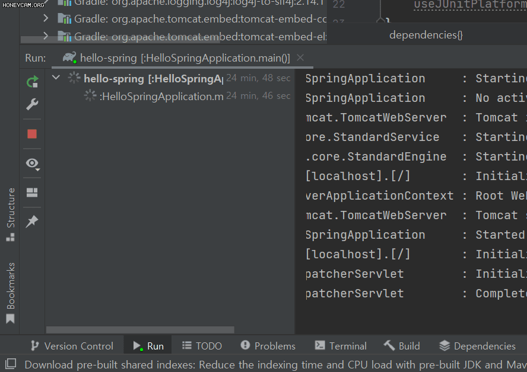

# 2 라이프러리 살펴보기

생성일: 2021년 12월 21일 오후 2:20

build에 있는 dependencies에 가져온 라이브러리는 몇 개 없지만

외부 라이브러리를 보면 여러 가지가 나타난다.

> 그래들과 메이븐 빌드 툴은 의존관계를 관리해준다.

예를 들면 `implementation 'org.springframework.boot:spring-boot-starter-web'` 를 사용하면 이 와 관련된 톰캣, 기타의 라이브러리를 가져온다. gradle은 이 모든 것을 다 가져온다. 나는 웹스타터만 필요한데 웹스타터는 다른 라이브러리 까지 필요하다

왼쪽 하단의 저거 누르면 서버가 뜨는데

우측 상단에 그래들을 누르면 라이브러리간의 의존성을 확인할 수 있다

예를 들어 타임리프 안에는 스프링 스타터가 있고 또 그 안에는 다른 라이브러리가 있고 그런거

여기 뜨는 별표는 중복을 의미한다.

고대의 선배들은 웹서버에 직접 설치를 하고 거기에 자바 코드를 밀어넣는 식으로 웹서버랑 자바랑 분리되어 있었다. 요즘에는 소스 라이브러리에서 웹서버를 가지고 있다. 실행만 해도 웹서버가 뜬다.라이브러리 하나 빌드해서 웹서버에 올리면 끝난다

핵심 라이브러리 구조

**스프링 부트 라이브러리**

- spring-boot-starter-web
  - spring-boot-starter-tomcat: 톰캣(웹서버)
  - spring-webmvc : 스프링 웹 MVC
- spring-boot-starter-thymeleaf: 타임리프 템플릿 엔진(View)
- sprint-boot-start(공통) : 스프링 부트 + 스프링 코어 + 로깅
  - spring-boot
    - spring-core
  - spring-boot-starter-logging
    - logback, slf4j

**테스트 라이브러리**

- junit: 테스트 프레임워크
- mockito: 목 라이브러리
- assertj: 테스트 코드를 좀 더 편하게 작성하게 도와주는 라이브러리
- spring-test: 스프링 통합 테스트 지원
