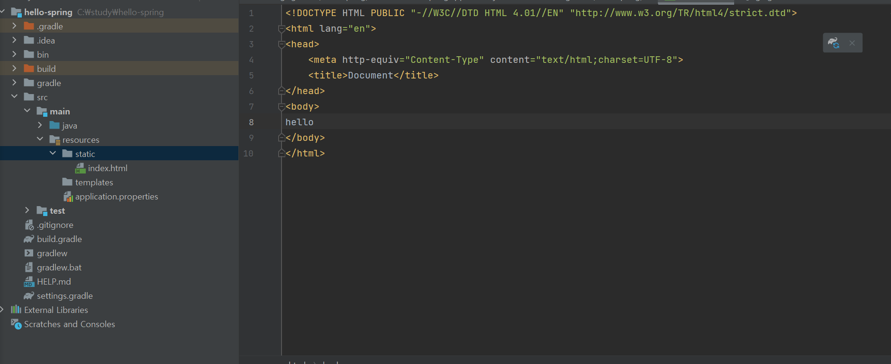

# 3 View 환경설정

생성일: 2021년 12월 21일 오후 2:20



main/resources/static에 들어가서 index.html을 생성한다. 그 안에 코드를 작성하고 서버를 껐다킨다.


서버 작동 버튼은 우측 하단에 있다. 단축키는 `ctrl + F2`


스프링은 범주가 광범위하기 때문에 모든 걸 기억하기는 힘들다. 필요한 것을 찾는 능력이 더 중요하다. 궁금한 거 있는 거 있으면 여기서 찾아보는 습관을 기르자.

[Spring makes Java simple.](https://spring.io/)

[Thymeleaf](https://www.thymeleaf.org/)

[Serving Web Content with Spring MVC](https://spring.io/guides/gs/serving-web-content/)


```java
package hello.hellospring.controller;

import org.springframework.stereotype.Controller;
import org.springframework.ui.Model;
import org.springframework.web.bind.annotation.GetMapping;

@Controller
public class HelloController {

    @GetMapping("hello")
    //여기서 GET은 http 메소드이다.
    public String hello(Model model) {
        model.addAttribute("data","hello!!");
            return "hello";
            //리턴 값을 문자로 반환하면 뷰리졸버(`viewResolver`)가 화면을 찾아서 처리한다.
            // 스프링부트 템플릿엔진 기본 viewName 매핑
            // `resources:templates/`+{ViewName}+`.html`
    }
}
```


```java
<!DOCTYPE html>
<html xmlns:th="http://www.thymeleaf.org">
<head>
    <meta http-equiv="Content-Type" content="text/html;charset=UTF-8">
    <title>hello</title>
</head>
<body>
<p th:text="'안녕하세요. ' + ${data}" >안녕하세요. 손님</p>
<!--th는 타임리프의 th이다.-->
</body>
</html>
```


작동 원리 이미지


`model.addAttribute("data","hello!!");` 다른 곳의 코드는 같고 컨트롤러의 값을 바꾸면 바로 반영된다.


`model.addAttribute("data","spring!!");` 라고 적으면 위의 화면이 나온다.

참고로 spring-boot-devtools 라이브러리를 추가하면, html 파일 컴파일만 해주면 서버 재시작 없이 view 파일 변경 가능하다.
