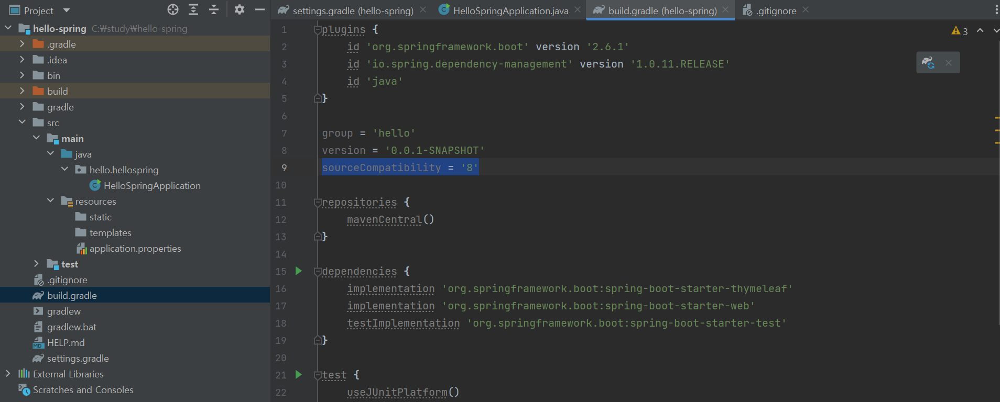

# [오류] Cause: invalid source release: 11

생성일: 2021년 12월 21일 오후 2:20

`Cause: invalid source release: 11`

제일 처음 뜬 오류로 원인은 자바 버전이 맞지 않아서다.

삘드로 들어가서 `sourceCompatibility = '11'` 를 본인 컴퓨터에 깔린 자바 버전으로 바꿔준다.

자바 버전 확인은 시작 프로그램에서 확인 가능하다.

---

**출처**

[https://aig2029.tistory.com/245](https://aig2029.tistory.com/245)
