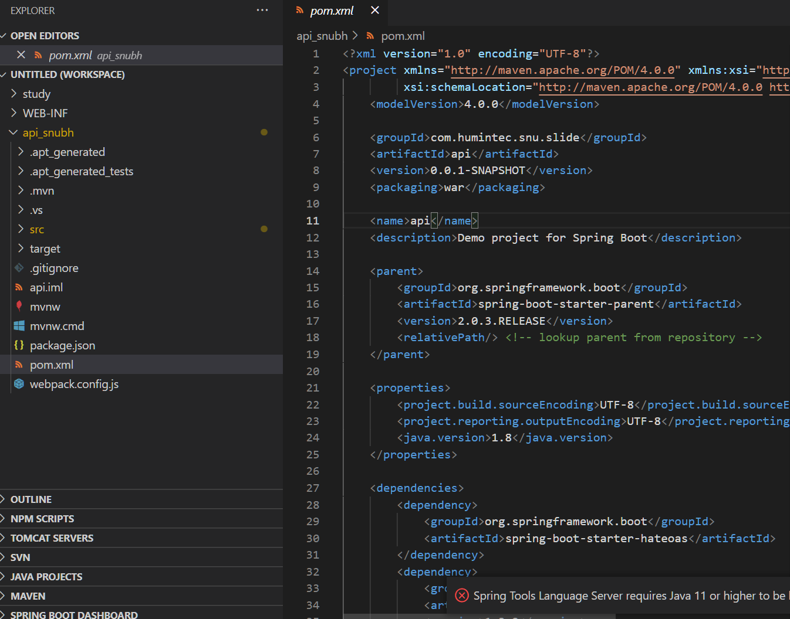

# Maven과 Gradle

생성일: 2021년 12월 21일 오후 2:20

## 빌드 관리 도구란?

- 프로젝트에서 필요한 xml, properties, jar 파일들을 자동으로 인식하여 빌드해주는 도구이다.
- 소스 코드 컴파일, 테스트, 정적 분석 하여 실행 가능한 앱으로 빌드해준다.
- 프로젝트 정보 관리, 테스트 빌드, 배포
- 외부 라이브러리를 참조하여 자동으로 다운로드 및 업데이트 관리
- 자바의 대표적인 빌드 도구 : Ant, Maven, Gradle

## 메이븐(Maven)이란?

- 자바의 대표적인 관리도구였던 Ant 대체하기 위해 개발됨
- 프로젝트의 외부 라이브러리를 쉽게 참조할 수 있도록 pom.xml 파일로 명시하여 관리한다. 아래 사진은 pom 파일의 일부이다.
  
- 참조한 외부 라이브러리에 연관된 다른 라이브러리도 자동 관리

### 메이븐을 사용하는 이유

- 기존의 사용하던 Ant는 빌드의 기능만 존재
- Maven에 자동으로 라이브러리를 관리해주는 기능이 추가
- 다운받아 사용하던 라이브러리에 변동 사항이 있으면 자동 업데이트
- Ant
  - XML 기반의 빌드 스크립트
  - 자유로운 빌드 단위 지정
  - 간단하고 사용하기 쉬움
  - 대규모 프로젝트에서 복잡해지는 경향이 있다.
  - 라이플 사이클이 없다
    - 라이플 사이클이란, 단계적으로 진행되는 사이클.
- Maven
  - XML 기반 빌드 스크립트
  - 라이플 사이클 도입
  - **pom.xml로 편하게 Dependency 관리 - 중요 이유**

### 메이븐의 간단 사용법

- pom.xml 파일을 활용하여 빌드 및 관리
- pom.xml의 역할
  - 프로젝트 정보 관리
  - 해당 프로젝트에서 사용하는 외부 라이브러리 관리
  - 해당 프로젝트의 빌드 관령 설정

### 메이븐 대표 태그 설명


```java
<modelVersion>4.0.0</modelVersion>

    <groupId>com.humintec.snu.slide</groupId>
    <artifactId>api</artifactId>
    <version>0.0.1-SNAPSHOT</version>
    <packaging>war</packaging>

    <name>api</name>
    <description>Demo project for Spring Boot</description>

    <parent>
        <groupId>org.springframework.boot</groupId>
        <artifactId>spring-boot-starter-parent</artifactId>
        <version>2.0.3.RELEASE</version>
        <relativePath/> <!-- lookup parent from repository -->
    </parent>

    <properties>
        <project.build.sourceEncoding>UTF-8</project.build.sourceEncoding>
        <project.reporting.outputEncoding>UTF-8</project.reporting.outputEncoding>
        <java.version>1.8</java.version>
    </properties>

    <dependencies>
        <dependency>S
            <groupId>org.springframework.boot</groupId>
            <artifactId>spring-boot-starter-hateoas</artifactId>
        </dependency>
        <dependency>
            <groupId>org.mybatis.spring.boot</groupId>
            <artifactId>mybatis-spring-boot-starter</artifactId>
            <version>1.3.2</version>
        </dependency>

        <dependency>
            <groupId>org.springframework.boot</groupId>
            <artifactId>spring-boot-devtools</artifactId>
            <scope>runtime</scope>
        </dependency>
        <dependency>
            <groupId>mysql</groupId>
            <artifactId>mysql-connector-java</artifactId>
            <scope>runtime</scope>
        </dependency>
		<dependency>
		    <groupId>org.bgee.log4jdbc-log4j2</groupId>
		    <artifactId>log4jdbc-log4j2-jdbc4.1</artifactId>
		    <version>1.16</version>
 		</dependency>
        <dependency>
            <groupId>org.springframework.boot</groupId>
            <artifactId>spring-boot-starter-test</artifactId>
            <scope>test</scope>
        </dependency>
        <dependency>
            <groupId>org.json</groupId>
            <artifactId>json</artifactId>
            <version>RELEASE</version>
            <scope>compile</scope>
        </dependency>
        <dependency>
            <groupId>org.webjars</groupId>
            <artifactId>jquery</artifactId>
            <version>3.3.1</version>
        </dependency>
        <dependency>
            <groupId>org.webjars.npm</groupId>
            <artifactId>openseadragon</artifactId>
            <version>2.4.0</version>
        </dependency>
        <dependency>
            <groupId>org.webjars.npm</groupId>
            <artifactId>axios</artifactId>
            <version>0.18.0</version>
        </dependency>
		<dependency>
			<groupId>org.springframework.boot</groupId>
			<artifactId>spring-boot-starter-tomcat</artifactId>
			<scope>provided</scope>
		</dependency>
		<dependency>
			<groupId>org.apache.tomcat.embed</groupId>
			<artifactId>tomcat-embed-jasper</artifactId>
			<scope>provided</scope>
		</dependency>
		<dependency>
			<groupId>javax.servlet</groupId>
			<artifactId>jstl</artifactId>
		</dependency>
		<!-- https://mvnrepository.com/artifact/com.hynnet/jimi-pro -->
		<dependency>
		    <groupId>com.hynnet</groupId>
		    <artifactId>jimi-pro</artifactId>
		    <version>1.0.0</version>
		</dependency>
		<dependency>
			<groupId>org.springframework.boot</groupId>
			<artifactId>spring-boot-configuration-processor</artifactId>
			<optional>true</optional>
		</dependency>
		<dependency>
		 <groupId>org.apache.poi</groupId>
		 <artifactId>poi</artifactId>
		 <version>3.7</version>
		</dependency>
		<dependency>
		 <groupId>org.apache.poi</groupId>
		 <artifactId>poi-ooxml</artifactId>
		 <version>3.7</version>
		</dependency>
    </dependencies>
    <build>
        <plugins>
           # <plugin>
                <groupId>org.springframework.boot</groupId>
                <artifactId>spring-boot-maven-plugin</artifactId>
            </plugin>
        </plugins>
    </build>
```

## 그래들(Gradle) 이란?

- Grovvy 스크립트를 활용한 빌드 관리 도구
- 안드로이드 프로젝트의 표준 빌드 시스템으로 채택
- 멀티 프로젝트(Multi-Project)의 빌드에 최적화하여 설계
- Maven에 비해 더 빠른 처리속도를 가지고 있음 (태그가 아닌 스크립트 방식이라서)
- Maven에 비해 더 간결한 구성


### 그래들 대표 용어


## 그래들과 메이븐 비교

|        | Gradle                 | Maven   |
| ------ | ---------------------- | ------- |
| 점유율 | 낮다(하지만 오르는 중) | 높다    |
| 성능   | Good                   | Bad     |
| 파일   | build.gradle           | pom.xml |
| 설치   | 없이 사용 가능         | 해야함  |

---

**출처**

[https://www.youtube.com/watch?v=3Jp9kGDb01g](https://www.youtube.com/watch?v=3Jp9kGDb01g)
