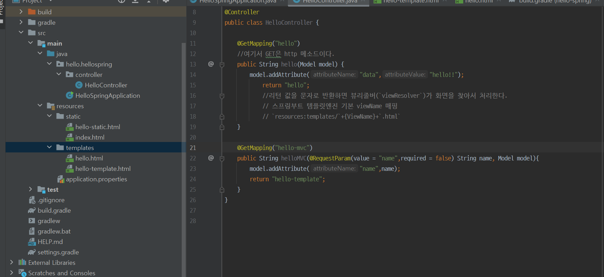

# 2 MVC와 템플릿 엔진

생성일: 2021년 12월 21일 오후 2:20

- MVC : Model, View, Controller
- 과거에는 controller와 view가 구별되어 있지 않아서 view 모든 걸 다 했다. 그걸 model 1 방식이라고 한다.
- View는 화면을 그리는 데 모든 역량을 집중해야한다. Controller은 내부적인 로직을 관리하는게 중요하다.

- Controller의 로직을 추가하기

- View에서 구현하기

- 실제 작동 되는지 [localhost:8080/hello-mvc?name=spriiing!!](http://localhost:8080/hello-mvc?name=spriiing!!으로) 으로 들어가서 확인한다.
- name= 뒤의 값이 바뀌면 그대로 프론트에 반영된다

- MVC의 원리를 설명한 이미지
