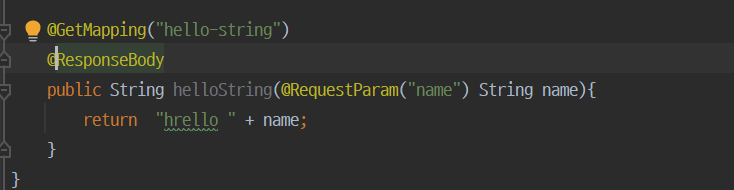

# 3 API

생성일: 2021년 12월 21일 오후 2:20

정적 컨텐츠를 제외하면 html로 내리는지 아니면 api로 바로 내리는지 두 가지로 나뉜다.

### @ResponseBody 문자 반환



@ResponseBody란 html에서 body가 아닌 body 부분에 이 내용을 집적 넣어주겠다는 의미


이전에 mvc 컨트롤러와 똑같아 보이지만 개발자 도구를 열어보면 사실 다르다.


만약 이런 방식으로 문자가 아닌 객체를 넘긴다면


json 형식의 파일로 나온다. key = “name” value = “spriiiiiiiing!!”

예전엔 그대로 html 태그를 넣는 mvc 방식이 많이 쓰였으나 api가 가벼워서 json 방식으로 통일이 됐다. spring의 기본도 @Responsebody가 json으로 반환된다.


intelliJ에서 `alt + Insert` 을 누르면 GetterSetter가 나온다. 이걸 java bin jack 이라고 한다. 프로퍼티 접근 방식이라한다.

```java
static class  Hello {
        private  String name;

        public String getName() {
            return name;
        }

        public void setName(String name) {
            this.name = name;
        }
```

## @ResponseBody 사용 원리


@ResponseBody가 있으면 그대로 데이터를 넘긴다. 만약 문자라면 바로 html에 넘기지만 객체를 넘기면 default가 json 방식으로 만들어서 넘긴다. 기존에 ViewResolver 대신 HttpMessageConverter가 반응한다.

- HTTP의 BODY에 문자 내용을 그대로 반환
- ViewReslover 대신 HttpMessageConverter가 동작
- 기본 문자처리 : StringHttpMessageConverter
- 기본 객체처리 : MappingJackson2HttpMessageConverter
- byte 처리 등등 기타 여러 HttpMessageConverter가 기본으로 등록
