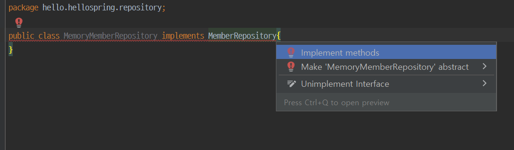

# 2 회원 도메인과 리포지토리 만들기

생성일: 2021년 12월 21일 오후 3:21



Alt+Enter

## 1. domain

1. 도메인 패키지 를 만들고 아이디와 이름을 등록
2. gettersetter를 만들어 준다.


```java
package hello.hellospring.domain;

public class Member {

    private Long id;
    private String name;

    public Long getId() {
        return id;
    }

    public void setId(Long id) {
        this.id = id;
    }

    public String getName() {
        return name;
    }

    public void setName(String name) {
        this.name = name;
    }
}
```

- 아이디와 이름을 저장한다.

## 2. repository

### MemberRepository UI

```java
package hello.hellospring.repository;

import hello.hellospring.domain.Member;

import java.util.List;
import java.util.Optional;

public interface MemberRepository {
    Member save(Member member);
    Optional<Member> findById(Long id);
    Optional<Member> findByName(String name);
    List<Member> findAll();

}
```

- 기능
  - 멤버 저장하기
  - 아이디로 멤버 찾기
  - 이름으로 멤버 찾기
  - 모든 회원 리스트를 반환

### MeomoryMemberRepository

```java
package hello.hellospring.repository;

import hello.hellospring.domain.Member;

import java.util.*;

public class MemoryMemberRepository implements MemberRepository{

    private static Map<Long, Member> store = new HashMap<>();
    private static long sequence = 0L;

    @Override
    public Member save(Member member) {
         member.setId(++sequence);
        store.put(member.getId(), member);
        return member;
    }
    //id와 name은 이미 있다는 가정하에 아이디를 셋팅해준다.

    @Override
    public Optional<Member> findById(Long id) {
        return Optional.ofNullable(store.get(id));
    }
    //만약 결과가 없을 때를 위해 Optional.ofNullable로 감싸준다.

    @Override
    public Optional<Member> findByName(String name) {
        return store.values().stream()
                .filter(member -> member.getName().equals(name))
                .findAny();
    }
    //루프로 돌리면서 filter로 람다를 사용. 파라미터에 넘어온 이름과 같은지 확인하고 찾으면 반환한다.
    //findAny : 하나라도 찾는 것

    @Override
    public List<Member> findAll() {
        return new ArrayList<>(store.values());
    }
}
```
