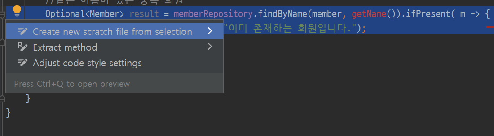

# 4 회원 서비스 개발

생성일: 2021년 12월 22일 오후 1:41

## 회원가입

```java
public Long join(Member member) {
        //같은 이름이 있는 중복 회원
        Optional<Member> result = memberRepository.findByName(member, getName()).ifPresent( m -> {
            throw new IllegalStateException("이미 존재하는 회원입니다.");
        });

        memberRepository.save(member);
        return member.getId();
    }
}
```

- 로그인을 하는 메소드
- 같은 이름이 있는 중복 회원 경우 로직이 길어지면 메소드로 추출하는 것이 좋다.



- `alt + enter` 하면 메소드를 추출할 수 있다.

```java
public Long join(Member member) {
        //같은 이름이 있는 중복 회원 X
        validateDuplicateMember(member); // 중복 회원 검증
        memberRepository.save(member);
        return member.getId();
    }

    private void validateDuplicateMember(Member member) {
        Optional<Member> result = memberRepository.findByName(member, getName()).ifPresent(m -> {
            throw new IllegalStateException("이미 존재하는 회원입니다.");
        });
    }
```

- respository는 단순히 개발스럽게 클래스명을 선택한다.
- 서비스 클래스는 비지니스에 가까운 클래스명을 사용해야한다.

## 전체 회원 조회

```java
public List<Member> findMembers(){
        return memberRepository.findAll()
    }

    public Optional<Member> findOne(Long memberID){
        return memberRepository.findById(memberID)
    }
```
