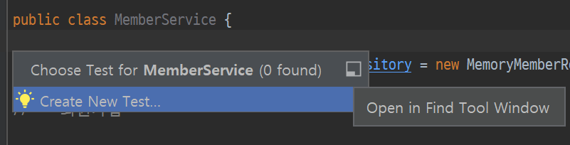

# 5 회원 서비스 테스트

생성일: 2021년 12월 22일 오후 4:44

- **테스트 파일 쉽게 만드는 법**
  
  - `ctrl + shfit + T`
- 테스트 코드는 실제 빌드에 들어가지 않는다.

### 테스트 코드 작성법

```java
@Test
    void 회원가입() {
        //given
        Member member = new Member();
        member.setName("hello");

        //when
        Long saveId = memberService.join(member);

        //then
        Member findMember = memberService.findOne(saveId).get();
        assertThat(member.getName()).isEqualTo(findMember.getName());
    }
```

1. 테스트 코드명은 한글로 적어도 상관없다.
2. given, when, then으로 나눠서 작성하는 것이 좋다.
   1. given : 어떤 상황이 주어졌을 때 - 어떤 데이터를 가지고 실험하는지 파악가능
   2. when : 실행 했을때 - 어떤 기능을 파악하려고 하는지 파악 가능
   3. then : 결과가 나와야한다.
3. 테스트는 정상 플로우가 아니라 예외 플로우가 훨씬 더 중요하다.

   ```java
   @Test
       public void 중복_회원_예외() {
           //given
           Member member1 = new Member();
           member1.setName("spring");

           Member member2 = new Member();
           member2.setName("spring");

           //when
           memberService.join(member1);
           assertThrows(IllegalStateException.class,() -> memberService.join(member2));
   				assertThat(e.getMessage()).isEqualTo("이미 존재하는 회원입니다.");

   //        try {
   //            memberService.join(member2);
   //            fail();
   //        } catch  (IllegalStateException e){
   							// 아무것도 적지 않아도 되긴하지만 정확한 검증을 위해 assertThat 삽입
   //            assertThat(e.getMessage()).isEqualTo("이미 존재하는 회원입니다.");
   //        };

           //then
       }
   ```

   - member1과 member2 이름이 똑같다면 예외 클래스가 나와야한다.
   - try catch 문법으로도 가능
   - `memberService.join(member2)` 이 로직을 실행할 때 `IllegalStateException` 클래스가 실행되라는 로직

4. 클리어 코드 작성

   ```java
   @AfterEach
       public void afterEach(){
           memberRepository.clearStore();
       }
   ```

- 문제점
  - MemberService의 `MemoryMemberRepository memberRepository = new MemoryMemberRepository();` 와
    MemberServiceTest의 `MemoryMemberRepository memberRepository = new MemoryMemberRepository();` 가 다른 객체이다.
  - 해결 방법 : DI
  ```java
  public class MemberService {

      private final MemberRepository memberRepository;

      public MemberService(MemberRepository memberRepository){
          this.memberRepository = memberRepository;
      };
  ```
  ```java
  MemberService memberService;
      MemoryMemberRepository memberRepository;

      @BeforeEach
      public void beforeEach() {
          memberRepository = new MemoryMemberRepository();
          memberService = new MemberService(memberRepository);
      }
  ```
