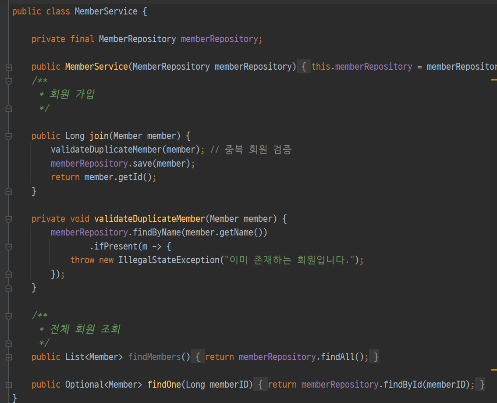

# 컴포넌트 스캔과 자동 의존관계 설정

생성일: 2021년 12월 23일 오후 2:21

- 해당 코드가 작동 안되는 이유는 `MemberService`가 순수 자바 코드이기 때문이다. 스프링이 이 코드를 알 수 있는 방법이 없다.(지금 당장)
- `@Service` 클래스위에 붙이면 컨트롤러에서 읽을 수있다.

- 이 Service 안에는 Component라는 애노테이션이 등럭 되어 있다.

- 리포지토리 위에도 `@Repository` 생성자를 선언해준다. 모두 정형화 된 패턴이다.

이제 MemberService 에서도 @Autowired를 선언해주고 실행시킨다.

- **스크린 빈을 등록하는 두가지 방법**
  - 컴포넌트 스캔과 자동 의존관계 설정
    - 위에서 한 방식이 컴포넌트 스캔 방식이다.
    - `@Component`를 포함하는 다음 애노테이션도 스프링 빈으로 자동 등록 되기 때문이다.
      - `@Controller`
      - `@Service`
      - `@Repository`
  - 자바 코드로 직접 스프링 빈 등록하기
- `@Component` 애노테이션이 있으면 스프링 빈으로 자동 등록된다.
- `@Controller` 컨트롤러가 스프링 빈으로 자동 등록된 이유도 컴포넌트 스캔 때문이다.
  
  > 스프링은 스프링 컨테이너에 스프링 빈을 등록할 때, 기본으로 싱글톤으로 등록한다(유일하게 하나만 등록해서 공유한다) 따라서 같은 스프링 빈이면 모두 같은 인스턴스다. 설정으로 싱글톤이 아니게 설정할 수 있지만, 특별한 경우를 제외하면 대부분 싱글톤을 사용한다.
