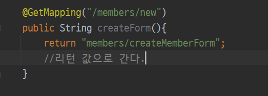

# 회원 웹 기능 - 등록

생성일: 2021년 12월 24일 오후 4:55

1. `controller/MemberController`에 `@GetMapping` 방식으로 경로 결과값 지정

   

2. 지정한 경로에 html 생성

   

3. controller에 MemberForm 생성

   

4. `controller/MemberController` 에 `@PostMapping` 설정

   
