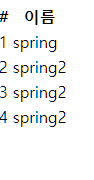

# 순수 JDBC

생성일: 2021년 12월 27일 오후 1:25

[[spring입문]스프링 DB 접근 기술 (1)](https://velog.io/@ksmlucky/spring%EC%9E%85%EB%AC%B8%EC%8A%A4%ED%94%84%EB%A7%81-DB-%EC%A0%91%EA%B7%BC-%EA%B8%B0%EC%88%A0-1#%ED%99%98%EA%B2%BD-%EC%84%A4%EC%A0%95)




```
//외부 db를 추가하는 과정중에 스프링이 제공한 config 빼고 기존의 코드를 손대지 않는다.
//이것을 편하게 해주는게 spring boot의 최대 장점이다.

```


