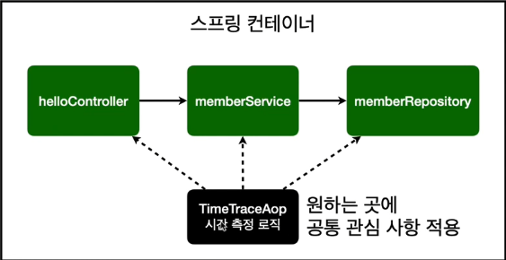

# AOP가 필요한 상황

생성일: 2021년 12월 29일 오후 3:17

## AOP가 필요한 상황

```tsx
package hello.hellospring.service;

import hello.hellospring.domain.Member;
import hello.hellospring.repository.MemberRepository;
import hello.hellospring.repository.MemoryMemberRepository;
import org.springframework.beans.factory.annotation.Autowired;
import org.springframework.stereotype.Service;
import org.springframework.transaction.annotation.Transactional;

import java.util.List;
import java.util.Optional;

import static java.lang.Character.getName;

//다른 컨트롤러가 하단 클래스를 읽을 수 있도록
@Transactional
public class MemberService {

    private MemberRepository memberRepository;

    public MemberService(MemberRepository memberRepository) {
        this.memberRepository = memberRepository;
    };

    /**
     * 회원 가입
     */

    public Long join(Member member) {

        long start = System.currentTimeMillis();

        try {
            validateDuplicateMember(member); // 중복 회원 검증
            memberRepository.save(member);
            return member.getId();
        } finally {
            long finish = System.currentTimeMillis();
            long timeMs = finish - start;
            System.out.println("join =" + timeMs + "ms");
        }
    }

    private void validateDuplicateMember(Member member) {
        memberRepository.findByName(member.getName())
                .ifPresent(m -> {
                    throw new IllegalStateException("이미 존재하는 회원입니다.");
                });
    }

    /**
     * 전체 회원 조회
     */
    public List<Member> findMembers() {
        long start = System.currentTimeMillis();
        try {
            return memberRepository.findAll();
        } finally {
            long finish = System.currentTimeMillis();
            long timeMs = finish - start;
            System.out.println("findMembers = " + timeMs + "ms");
        }
    }

    public Optional<Member> findOne(Long memberID) {
        return memberRepository.findById(memberID);
    }
}
```

- 모든 메소드의 호출 시간을 측정하고 싶다면?
- 공통 관심 사항(cross-cutting concern) vs 핵심 관심 사항(core concern)
- 회원 가입 시간, 회원 조회 시간을 측정하고 싶다면?

**“문제”**

- 회원가입, 회원 조회에 시간을 측정하는 기능은 핵심 관심 사항이 아니다.
- 시간을 측정하는 로직은 공통 관심 사항이다.
- 시간을 측정하는 로직과 핵심 비즈니스의 로직이 섞여서 유지보수가 어렵다.
- 시간을 측정하는 로직을 별도의 공통 로직으로 만들기 매우 어렵다.
- 시간을 측정하는 로직을 변경할 때 모든 로직을 찾아가면서 변경해야 한다.

```java
try {
	예외 발생이 예상되는 로직
}catch(예외 클래스의 인스턴스){
	예외가 발생했을 때 실행되는 로직
}finally{
	예외여부와 관계없이 실행되는 로직
}
```

## AOP 적용

- AOP : Aspect Oriented Programming
- 공통 관심 사항(cross-cutting concern) vs 핵심 관심 사항(core concern) 분리



**시간 측정 AOP 등록**

**“해결”**

- 회원가입, 회원 조회등 핵심 관심사항과 시간을 측저앟는 공통 관심사항을 분리한다.
