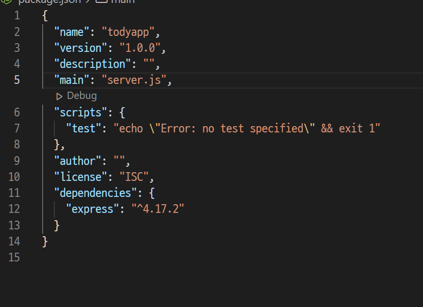

# Node.js&Express_install

생성일: 2022년 1월 3일 오전 8:42

# Node.js&Express_install

- npm init
  - 설치 중 다른 건 수정하지 않고 main만 server.js로 설정
  - package.json이 설치된다. 이곳에서 프로그램의 DI와 같은 정보를 한 눈에 파악할 수 있다.
- npm i express
  - express는 node.js를 쉽게 사용하기 위한 라이브러리다.
