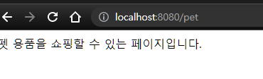

# Express_setting&Get

생성일: 2022년 1월 3일 오전 8:42

# Express_setting&Get

```jsx
const express = require("express");
const app = express();

app.listen(8080, function () {
  console.log("listening on 8080");
});
```

- server.js 생성한다.
- 위의 코드는 express 문서에 나와있는 서버를 띄우기 위한 기본 템플릿이다.

```jsx
app.get("/pet", function (req, res) {
  res.send("펫 용품을 쇼핑할 수 있는 페이지입니다.");
});
```



- GET 요청 처리
  - CRUD의 기본인 GET 처리는 위의 코드처럼 생성한다.

```jsx
app.get("/beauty", function (req, res) {
  res.send("뷰티 용품을 쇼핑할 수 있는 페이지입니다.");
});
```

- GET 요청 처리 방법을 응용해서 **[localhost:8080/beauty](http://localhost:8080/beauty) 접속시** 뷰티 용품을 쇼핑할 수 있는 url을 만들려면 위처럼 코드를 적으면 된다.
