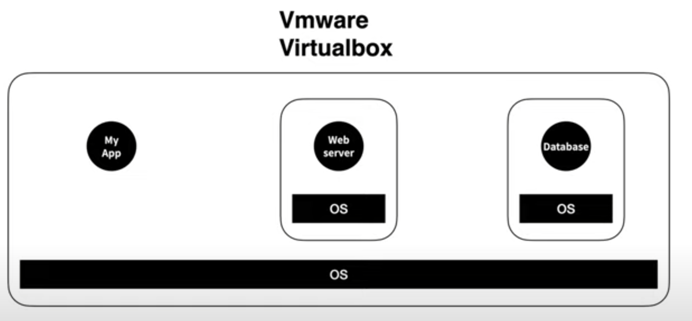

# Docker

> 컨테이너 기반 가상화 도구
> 

## Docker의 필요성

한 마디로 정의하면 ***내 컴퓨터에서는 안되는데?*** 이 문제를 해결해준다. 이걸 environment disparity라고 칭한다.

웹 사이트를 돌리기 위해서는 기본적으로 Frontend + Backend + Database가 필요하다.  하나의 프로젝트만 진행한다면 상관없지만 만약 여러가지 프로젝트를 돌릴 경우를 생각해보자. 

프로젝트A에서 Frontend의 nodejs 구버전을 사용하는데 프로젝트B에서는 신버전을 사용한다면 충돌이 발생한다. 이를 해결하기 위해서 처음 등장한 건 virtualBox와 같은 가상환경이다. 

하나의 컴퓨터에 가상으로 컴퓨터를 만들고 그 위에 운영체제를 설치하고 그 위에 필요한 프로젝트 파일을 올린다. 이전의 충돌 문제는 해결해주지만 명백한 단점이 존재한다. 

하나는 용량상의 부담이다. 웹서버를 위해서 커다란 운영체제를 다운로드 받아야한다.  두 번째는 용량상 성능의 저하다. 이미 OS가 깔린 상태에서 또 OS를 설치하니 기능이 중복되고 속도가 느려진다. 또 컴퓨터 성능과 자원을 환경마다 칼같이 제한된다. 성능이 중요한 서버의 경우 크리티컬한 문제가 된다.

이보다 더 효율적으로 환경을 분리하기 위해 등장한 것이 Docker의 container이다.

운영 체제 전체가 설치된 것이 아니라 앱을 실행하는데 필요한 라이브러리와 앱만 들어가 있다. Linux OS에는 Container 기능이 내장되어 있다. 이 기능을 이용해서 쉽게 해주는 프로그램이 여러가지 있다. 그 중에서 가장 유명한 것이 Docker이다.

덕분에 하나의 컴퓨터로 OS를 두 번 설치하지 않고 성능 저하되지 않은 상태로 여러가지 프로젝트를 돌릴 수 있다.

## Docker에서 사용되는 단어

- Container
    
    Host에서 실행되는 격리된 실행 환경
    
    이미지의 목적에 따라 생성되는 프로세스 단위의 격리 환경
    

- Image
    
    container 실행에 필요항 일종의 패키지다. node.js 이미지는 node.js를 실행하기 위한 모든 파일, Oreacle 이미지는 Oracle을 실행하기 위한 파일과 명령어 포트 정보 등을 가지고 있다. 따라서 이미진 용량은 매우 크지만 가상 머신에 비하면 작다.
    
- Dockerfile
    
    도커 이미지를 생성하기 위한 커맨드가 적혀있다. 소프트웨어를 새로운 환경에 실행시킬 때 반복적으로 사용하게 되는 커맨드를 도커 파일에 모두 작성하게 된다.
    

→ Dockerfile로 Image를 만들고 Image로 Container를 만든다.

- 클러스터
    
    각기 다른 서버들을 하나로 묶어 하나의 시스템 같이 동작하게 하는 것
    

---

**참고자료**

[Docker - 인코덤, 생물정보 전문위키](http://www.incodom.kr/Docker#h_881e4d54e47b27bac35945f602eaf217)

[가장 쉽게 배우는 도커](https://www.youtube.com/watch?v=hWPv9LMlme8)

[[10분 테코톡] ☂️ 검프의 Docker #이론편](https://www.youtube.com/watch?v=IiNI6XAYtrs&t=384s)

[도커 컨테이너(Container)와 이미지(Image)란?](https://hoon93.tistory.com/48)