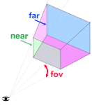
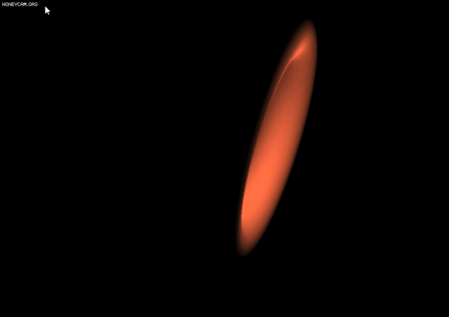
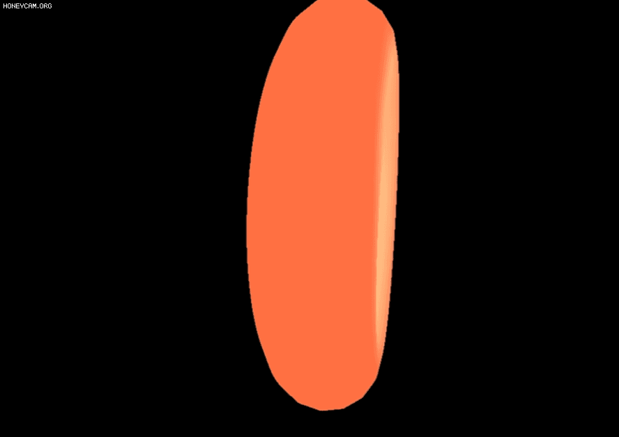

# Three.js

[](https://www.youtube.com/results?search_query=three+js)

## Three.js란?

> [웹페이지에 3D 객체를 쉽게 렌더링하도록 도와주는 자바스크립트 3D 라이브러리](https://threejs.org/manual/#ko/fundamentals)

렌더링하기 위해서 WebGL을 사용한다. WebGL은 또 무엇일까? Web Graphics Library의 약자로 웹 상에서 2D 및 3D 그래픽을 렌더링하기 위한 로우 레벨 JAvascript API이다. html의 canvas 요소가 그것이다. [WebGL은 점, 선, 삼각형을 사용하는 단순한 시스템이다.](https://webglfundamentals.org/webgl/lessons/ko/webgl-fundamentals.html) 3차원의 빛과 Three.js이다.

## Three.js 주요 개념 3가지

### Scene

> 오브젝트을 담아주는 보관함

```jsx
const scene = new THREE.Scene();
```

### Camera

> Scene를 보기 눈의 위치

```jsx
// const camera = new THREE.PerspectiveCamera(fov, aspect, near, far);
const camera = new THREE.PerspectiveCamera(
  75,
  window.innerWidth / window.innerHeight,
  0.1,
  1000
);
```



- fov : 시야각
- aspect
  - 캔버스 가로세로 비율
  - 보통 브라우저 크기와 같다.
- far + near (View Frustum)
  - Frustum은 한국어로 [절두체](https://docs.unity3d.com/kr/530/Manual/UnderstandingFrustum.html#:~:text=Near%20%ED%81%B4%EB%A6%AC%ED%95%91%20%ED%8F%89%EB%A9%B4%EB%B3%B4%EB%8B%A4%20%EC%B9%B4%EB%A9%94%EB%9D%BC,%EC%9D%B4%EA%B2%83%EC%9D%84%20%EB%B7%B0%20Frustum%EC%9D%B4%EB%9D%BC%EA%B3%A0%20%ED%95%A9%EB%8B%88%EB%8B%A4.)로 그림과 같이 잘린 피라미드 모양을 뜻한다.
  - 카메라 앞에 렌더링되는 공간 범위를 지정하는 요소
  - 이 둘의 높이는 fov, 너비는 fov와 aspect에 의해 결정됨
  -

### Renderer

> 카메라 안에서 오브젝트를 그려준다.

```jsx
renderer.setPixelRatio(window.devicePixelRatio);
renderer.setSize(window.innerWidth, window.innerHeight);
camera.position.setZ(30);

renderer.render(scene, camera);
```

## Object 구성하는 3가지 요소

### Geometry

> 모양을 잡기 위한 (x,y,z)축

```jsx
const geometry = new THREE.TorusGeometry(10, 3, 16, 100);
```

[three.js](https://threejs.org/docs/index.html#api/en/geometries/TorusGeometry)

- 공식 문서에서 기본 도형을 확인할 수 있다.

### Material

> 오브젝트를 감싸주는 컬러나 텍스쳐

```jsx
const material = new THREE.MeshStandardMaterial({
  color: 0xff6347,
  wireframe: ture,
});
```

[three.js](https://threejs.org/docs/index.html#api/en/materials/MeshStandardMaterial)

- 이것도 공식문서에서 다양한 종류를 확인할 수 있다.
- 커스텀 쉐이드도 따로 사용할 수 있다.
- 기본적으로 빛이 없는 속성이다.

### Mesh

> geometry + Meaterial

```jsx
const torus = new THREE.Mesh(geometry, material);

scene.add(torus);
```

## Animate loop | 움직임을 부여하자

```jsx
function animate() {
  requestAnimationFrame(animate);

  torus.rotation.x += 0.01;
  torus.rotation.y += 0.005;
  torus.rotation.z += 0.01;

  renderer.render(scene, camera);
}
animate();
```


- 여기까지 작성하고 사이트를 확인하면 돌아가는 도넛을 볼 수있다.

## Lighting | 빛을 넣어보자

와이어 프레임을 끄면 화면에 아무것도 보이지 않게 된다. 이유는 빛이 없기 때문이다.

### PointLight

```jsx
const pointLight = new THREE.PointLight(0xffffff);
pointLight.position.set(5, 5, 5);

scene.add(pointLight);
```



- 웹 브라우저에서 중앙에만 빛이 생긴 걸 확인할 수 있다.

### AmbientLight

- 전체에 빛을 고르게 주고 싶다면 `AmbientLight` 를 사용하면 된다.

```jsx
const pointLight = new THREE.PointLight(0xffffff);
pointLight.position.set(5, 5, 5);

const ambientLight = new THREE.AmbientLight(0xffffff);
scene.add(pointLight, ambientLight);
```



## Random Generation | 별을 만들어 보자

```jsx
//별 추가
function addStar() {
  const geometry = new THREE.SphereGeometry(0.25, 24, 24);
 //모양을 설정하고
  const material = new THREE.MeshStandardMaterial({ color: 0xffffff });
	//모양을 감쌀 포장지를 선택하고
const star = new THREE.Mesh(geometry, material);
	//둘을 합친다!

  const [x, y, z] = Array(3)
    .fill()
    ****.map(() => THREE.MathUtils.randFloatSpread(100));

  star.position.set(x, y, z);
  scene.add(star);
}
Array(200).fill().forEach(addStar);
```

일단 작은 크기의 원형 geometry를 설정한다. 그리고 그 위를 감쌀 포장지인 meterial 설정을 한다. 그리고 이 둘을 Mesh로 합쳐준다. 이러면 별 하나가 생긴다.

근데 별 하나로는 우주 느낌이 나지 않는다. 별 여러개를 각각 다른 위치에 생성해줘야하낟.

```jsx
//별 추가
function addStar() {
  const geometry = new THREE.SphereGeometry(0.25, 24, 24);
  const material = new THREE.MeshStandardMaterial({ color: 0xffffff });
const star = new THREE.Mesh(geometry, material);

	//각각 별의 위치를 정해주자!
  const [x, y, z] = Array(3)
    .fill()
    ****.map(() => THREE.MathUtils.randFloatSpread(100));
		//각각 x,y,z 값에 랜덤으로 값을 생성해준다.

  star.position.set(x, y, z);
	//별의 위치를 정하고
  scene.add(star);
	//별을 더한다!
}
```

한 개의 별에게 x, y, z 값을 랜덤으로 생성해보자. array를 만들어서 그 안에 THREE.js의 기본 함수인 랜덤 값을 생성해주는 함수를 넣는다.

이후에 별의 위치를 이 x,y,z 값으로 정하고 스크린에 별을 추가한다. 한 개의 별의 랜덤 위치가 지정됐다.

```jsx
Array(200).fill().forEach(addStar);
```

별이 한 개로는 부족하기 때문에 200개를 만들고 그 안에 별을 만들어보자.


짜잔 그러면 별이 생성된다.

## Texture Mapping | 배경을 추가하자

```jsx
const spaceTexture = new THREE.TextureLoader().load("space.jpg");
scene.background = spaceTexture;
```

```jsx
const moonTexture = new THREE.TextureLoader().load("moon.jpg");
const normalTexture = new THREE.TextureLoader().load("normal.jpg");

const moon = new THREE.Mesh(
  new THREE.SphereGeometry(3, 32, 32),
  new THREE.MeshStandardMaterial({ map: moonTexture, normalMap: normalTexture })
);
```

텍스쳐를 더하는 문법이다. 하나의 텍스쳐가 아니라 여러가지 겹쳐서 사용 가능하다.


## Scroll Animation | 스크롤 애니메이션을 넣자

```jsx
function moveCamera() {
  const t = document.body.getBoundingClientRect().top;
  moon.rotation.x += 0.05;
  moon.rotation.y += 0.075;
  moon.rotation.z += 0.05;

  camera.position.z = t * -0.01;
  camera.position.x = t * -0.0002;
  camera.rotation.y = t * -0.0002;
}
document.body.onscroll = moveCamera;
//body에서 스크롤을 할 때마다 moveCamera 함수가 작동된다.
```

`const t = document.body.getBoundingClientRect().top;`
여기서 t는 선택한 요소의 상단 값을 나타낸다. 스크롤 될 때마다 달이 돌아가고 카메라 위치가 조금씩 뒤로 빠지게 된다.
