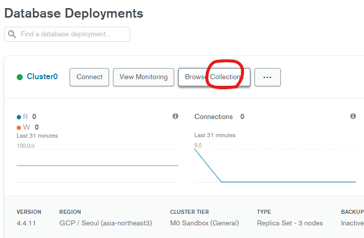

# Save_Database

생성일: 2022년 1월 3일 오후 1:54

## MongoDB 설정 만지기



- 데이터를 저장하기 위해서는 mongo db 홈페이지에 들어가 Browse Collection을 클릭한다.


- 해당 공간에서 Creat Database로 새로운 db와 collection을 생성할 수 있다.


- 참고는 database는 collection에 포함되는 개념이다.

## JS에서 설정 만지기

```jsx
db.collection().insertOne(데이터);
```

- 데이터 추가 문법
- collection을 선택하고 그 안에 데이터를 넣는다.

```jsx
client.connect((err) => {
  const db = client.db("todoapp");

  db.collection("post").insertOne({ name: "야호", _id: 1 }, (err, result) => {
    console.log("저장완료1");
    // perform actions on the collection object
    app.listen(8080, function () {
      console.log("listening on 8080");
    });
  });
});
```
