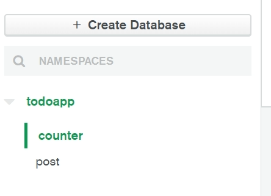

# Unique_id

생성일: 2022년 1월 13일 오후 1:36

## 고유 아이디의 중요성

mongoDb는 자료 저장시 자동으로 고유한 id가 생성된다. 개인이 원하는 아이디를 부여하는 것도 가능하다. 만약 총 게시물 갯수에 1씩 더해지는 아이디를 만든다고 해보자. 이렇게 데이터를 추가할 때마다 자동으로 1씩 증가시켜서 저장하는 기능을 auto increment라고 한다. mongo db에는 이런 기능이 따로 존재하지 않는다. 정수 말고 자동으로 부여되는 objectid로도 충분하기 때문이다.

**이러한 기능을 mongodb에서 구현한다면 어떻게 해야할까?**

현재 게시물에 +1을 하는 것은 좋은 방법이 아니다. 저장되는 시점에 따라 혼선이 생길 가능성이 있기 때문이다. 예를들면 게시물이 총 2개 있다고 치자. id:2인 리스트를 하나 지운다. 그 뒤에 게시물을 하나 더 생성하면 새 게시물도 id:2를 부여받게 된다. 삭제된 게시물도 새로 생긴 게시물도 똑같이 id:2가 부여된다.

대신 여지껏 발행된 총 게시물의 갯수를 기록하는 저장공간을 생성한다.

## 고유 아이디를 위한 counter collection 생성 후 읽어오기



- mongo db에 database를 새로 생성해준다.


- {totalPost:0, name:”게시물개수”}인 데이터를 만들어서 넣어준다. 사진은 두 번 발행하고 캡쳐한거라 2임

```jsx
const db = client.db("todoapp");
const counter = client.db("todoapp").collection("counter");

counter.findOne((err, result) => {
  console.log(result.totalPost);
  let 총게시물갯수 = result.totalPost;
});
```

- 발행된 총 게시물의 개수를 db에 불러온다.

## totalPost 수정하기

### updateOne으로 db 데이터 수정하기

```jsx
db.collection('counter').updateOne( {요런 이름의 자료를} , {이렇게 수정해주세요} , function(에러, 결과){
  console.log('수정완료')
})
```

- updateOne 함수에는 세 개의 파라미터가 필요하다.
  1. {name : ‘게시물갯수’} 처럼 이름이나 쿼리문
  2. { $set : { totalPost : 100 } } 수정할 값을 넣어준다.
     - $set 을 사용하면 변경이 되고
     - $inc를 사용하면 값만큼 더 할 수 있다.
     - operator
  3. 콜백함수로 실패나 성공시 실행할 코드를 넣는다.

```jsx
counter.updateOne(
  { name: "게시물개수" },
  { $inc: { totalPost: 1 } },
  (err, result) => {
    err && console.log(err);
  }
);
```

- 해당 코드를 실행하면 totalPost라는 항목이 1 증가한다.

```jsx
app.post("/add", function (요청, 응답) {
  const counter = db.collection("counter");

  counter.findOne((err, result) => {
    console.log(result.totalPost);
    let 총게시물갯수 = result.totalPost;

    post.insertOne(
      { _id: 총게시물갯수 + 1, 제목: 요청.body.title, 날짜: 요청.body.date },
      function (에러, 결과) {
        counter.updateOne(
          { name: "게시물개수" },
          { $inc: { totalPost: 1 } },
          (err, result) => {
            err && console.log(err);
          }
        );
      }
    );
  });
});
```

- /add 의 전체 코드
