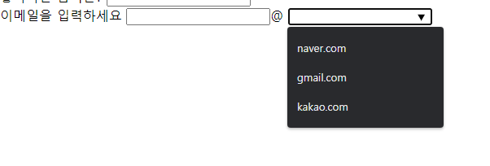

# 알면 유용한 HTML 태그

## Form

### <datalist>



```html
<form>
  <label for="sign-in">이메일을 입력하세요</label>
  <input type="text" />@
  <input type="text" list="sign-options" />
  <datalist id="sign-options">
    <option value="naver.com"></option>
    <option value="gmail.com"></option>
    <option value="kakao.com"></option>
  </datalist>
</form>
```

- 추천하는 선택지를 나타내는 option 값을 담는다.
- <select>는 옵션 값만 선택하고, <datalist>는 옵션 목록에 없는 값도 입력 가능하다. 입력창에 타이핑 시에 자동완성 기능을 제공한다. 회원가입시 이메일 도메인 선택할 때 사용하면 유용하다.

### <progress>


```html
<progress value="50" min="0" max="100"></progress>
```

- 어느 작업의 완료 정도를 나타내며, 주로 진행 표시줄의 형태를 띈다.

### <input type=”week”>


- 시간대가 없는 주-년 값과 주의 값을 구성하는 날짜를 입력하는 컨트롤
- 브라우저마다 모습이 다르다.

## 대화형 요소

### <details>


```html
<details>
  <summary>오늘 점심 밥</summary>
  <span>삼선볶음짬뽕</span>
</details>
```

- "열림" 상태일 때만 내부 정보를 보여주는 정보 공개 위젯 생성 → 토글을 만들 수 있다.

## 내장 콘텐츠

### <picture>

```html
<picture>
  <source
    srcset="https://via.placeholder.com/150/0000FF/808080"
    media="(min-width:1200px)"
  />
  <source
    srcset="https://via.placeholder.com/150/FF0000/808080"
    media="(min-width:900px)"
  />
  <source
    srcset="https://via.placeholder.com/150/FF00FF/808080"
    media="(min-width:500px)"
  />
  
</picture>
```

- 이미지 태그 3개 다운로드 받고 1개를 보여주는 것이 아니라 사용자가 보는 1개의 이미지만 다운로드 된다.
- source와 img 태그와 함께 사용된다. 브라우저가 soucre 태그를 지원하지 않을 때 img태그를 보여준다.
