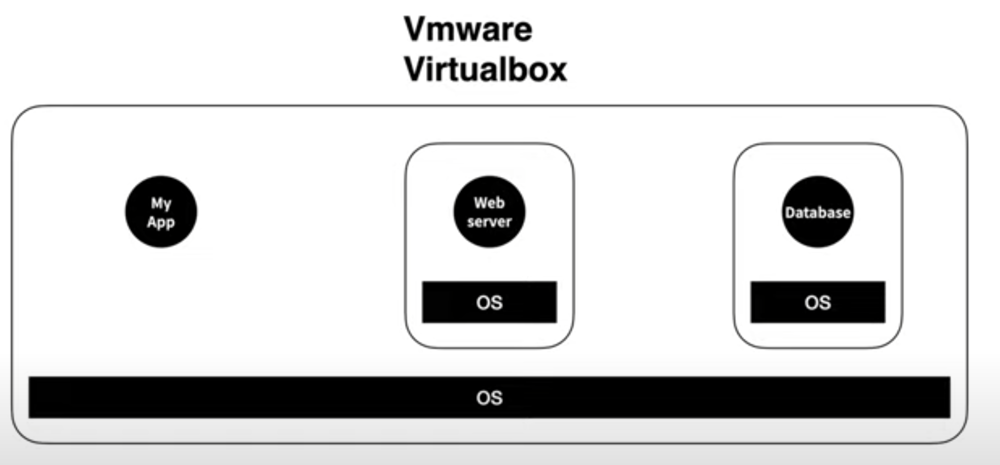

# Docker 기초 지식

생성일: 2022년 1월 12일 오전 8:41

> 컨테이너 기반 가상화 도구

## Docker의 필요성

한 마디로 정의하면 **_내 컴퓨터에서는 안되는데?_** 이 문제를 해결해준다. 이걸 environment disparity라고 칭한다.

웹 사이트를 돌리기 위해서는 기본적으로 Frontend + Backend + Database가 필요하다. 하나의 프로젝트만 진행한다면 상관없지만 만약 여러가지 프로젝트를 돌릴 경우를 생각해보자.

프로젝트A에서 Frontend의 nodejs 구버전을 사용하는데 프로젝트B에서는 신버전을 사용한다면 충돌이 발생한다. 이를 해결하기 위해서 처음 등장한 건 virtualBox와 같은 가상환경이다.

하나의 컴퓨터에 가상으로 컴퓨터를 만들고 그 위에 운영체제를 설치하고 그 위에 필요한 프로젝트 파일을 올린다. 가상환경은 이전의 충돌 문제는 해결해주지만 명백한 단점이 존재한다.

첫 번째, **용량 상의 부담**이다. 웹서버를 위해서 커다란 운영체제를 다운로드 받아야한다. 두 번째는 **성능의 저하**다. 이미 OS가 깔린 상태에서 또 OS를 설치하니 기능이 중복되고 속도가 느려진다. 또 컴퓨터 성능과 자원을 환경마다 칼같이 제한된다. 성능이 중요한 서버의 경우 크리티컬한 문제가 된다.

이보다 더 효율적으로 환경을 분리하기 위해 등장한 것이 Docker의 container이다.

운영 체제 전체가 설치된 것이 아니라 앱을 실행하는데 필요한 라이브러리와 앱만 들어가 있다. Linux OS에는 Container 기능이 내장되어 있다. 이 기능을 이용해서 쉽게 해주는 프로그램이 여러가지 있다. 그 중에서 가장 유명한 것이 Docker이다.

덕분에 하나의 컴퓨터로 OS를 두 번 설치하지 않고 성능 저하되지 않은 상태로 여러가지 프로젝트를 돌릴 수 있다.

## Docker란 무엇인가?

> 컨테이너를 사용하여 응용프로그램을 더 쉽게 만들고 배포하고 실행할 수 있도록 설계된 도구이며 컨테이너 기반의 오픈소스 가상화 플랫폼이며 생태계이다.

## Docker에서 사용되는 단어

- **Image**
  - container 실행에 필요한 일종의 패키지다. node.js 이미지는 node.js를 실행하기 위한 모든 파일, Oreacle 이미지는 Oracle을 실행하기 위한 파일과 명령어 포트 정보 등을 가지고 있다. 따라서 이미진 용량은 매우 크지만 가상 머신에 비하면 작다.
  - 코드, 런타임, 시스템 도구, 시스템 라이브러리 빛 설정과 같은 응용 프로그램을 실행하는 데 필요한 모든 것을 포함하는 가볍고 독립적이며 실행 가능한 **소프트웨어 패키지**
  - 안에는 **1. 컨테이너가 시작 될 때 사용하는 명령어(ex. docker run hello-world) 2. 파일 스냅샷**이 있다.
- **Container**
  - Host에서 실행되는 격리된 실행 환경
  - 이미지의 목적에 따라 생성되는 **프로세스 단위의 격리 환경**
  - 이미지의 인스턴스이며, 프로그램을 실행한다.
  - 코드와 모든 종속성을 패키지화하여 응용 프로그램이 한 컴퓨팅 환경에서 다른 컴퓨팅 환경으로 빠르고 안정적으로 실행되도록 하는 소프트웨어의 표준 단위
  - 일반적인 컨테이너가 물건을 한 상자에 넣어서 운송 해주는 것처럼 프로그램을 쉽게 이동 배포 할 수 있게 해준다.

> 도커 이미지는 프로그램을 실행하는데 필요한 설정이나 종속성을 가지며, 컨테이너를 생성한다. 도커 컨테이너를 이용하여 프로그램을 실행한다.

- **Dockerfile**
  도커 이미지를 생성하기 위한 커맨드가 적혀있다. 소프트웨어를 새로운 환경에 실행시킬 때 반복적으로 사용하게 되는 커맨드를 도커 파일에 모두 작성하게 된다.

→ Dockerfile로 Image를 만들고 Image로 Container를 만든다.

- **클러스터**
  각기 다른 서버들을 하나로 묶어 하나의 시스템 같이 동작하게 하는 것

## Docker 시작하기

`Docker run hello-world` 를 cmd 창에 입력해보자.

1. `Unable to find image 'hello-world:latest' locally`

   해당 명령어를 입력하면 도커 클라이언트가 도커 서버에 hello-world라는 이미지가 있는지 확인한다. 이미지가 존재할 경우 바로 컨테이너를 실행하고, 존재하지 않을 경우 **도커 허브**를 확인한다.

2. `latest: Pulling from library/hello-world`

   도커 허브에서 hello-world라는 이미지를 가져온다. 도커 서버에서 가져온 이미지로 실행을 시킨다.

## Docker 컨테이너 심화

이전에 **가상화 기술이 등장하기 전까지**는 하나의 서버를 하나의 용도로만 사용할 수 있었다. 이로 인해 서버의 남은 공간은 그대로 방치되고 하나의 OS, 하나의 프로그램만 운용했다. 안정적이긴 하지만 비효율적이다.

이를 해결하기 위해 **하이퍼 바이저 기반의 가상화 기술이 등장**했다. 하나의 서버에서 여러 개의 OS를 구동할 수 있게 해준다. 이때 하나의 서버를 호스트, 이 위에 올려지는 OS를 게스트라 한다. 이VM이라는 독립적인 가상 환경의 서버를 이용 가능해졌다.

하이퍼 바이저는 네이티브 하이퍼 바이저, 호스트형 하이퍼 바이저 **두 개**가 존재한다. **네이티브 HV**는 HV가 직접적으로 하드웨어를 제어한다. 이 덕분에 자원을 효율적으로 사용할 수 있으나 여러 하드웨어 드라이버를 세팅해야 하므로 설치가 어렵다.

**호스트형 HV**는 일반적인 소프트웨어처럼 호스트 OS 위에서 실행되며, 하드웨어 자원을 V< 내부 게스트 OS에 올리는 방식으로 사용하기 때문에 오버헤드가 크다. 하지만 게스트 OS 종류에 대한 제약이 없고 구현이 쉽다. 일반적으로 많이 이용한다.

> **어떻게 도커 컨테이너를 분리시킬까?**

리눅스에서 쓰이는 **Cgroup**과 **네임 스페이스** 개념을 우선적으로 알아야한다. 이 둘은 컨터이너와 호스트에서 실행되는 다른 프로세스 사이의 벽을 만드는 리눅스 커널 기능이다.

<aside>
💡 C Group

CPU, 메모리, Network Bandwith, HD i/o 등 프로세스 그룹의 시스템 리소스 사용량 관리
⇒ 프로세스를 작동시키는데 딱 필요한 양만 배정

</aside>

<aside>
💡 네임 스페이스

하나의 시스템에서 프로세스를 격리시킬 수 있는 가상화 기술
별개의 독립된 공간을 사용하는 것처럼 격리된 환경을 제공하는 경량 프로세스 가상화 기술

</aside>

> **C Rroup과 네임 스페이스를 어떻게 Docker에서 사용할 수 있을까?**

사실 도커 엔진에 리눅스 VM이 깔려있다! 하드웨어 → MacOs / Windows → 도커엔진 :(리눅스 VM→ 리눅스 커널) → 리눅스 커널 → 프로그램이 순서대로 깔려있다.

## Docker 이미지 심화

이미지는 컨테이너를 사용하기 위한 도구이다. 이미지 안에는 1. 컨테이너가 시작 될 때 사용하는 명령어(ex. docker run hello-world) 2. 파일 스냅샷이 있다.

---

**참고자료**

[Docker - 인코덤, 생물정보 전문위키](http://www.incodom.kr/Docker#h_881e4d54e47b27bac35945f602eaf217)

[가장 쉽게 배우는 도커](https://www.youtube.com/watch?v=hWPv9LMlme8)

[[10분 테코톡] ☂️ 검프의 Docker #이론편](https://www.youtube.com/watch?v=IiNI6XAYtrs&t=384s)

[도커 컨테이너(Container)와 이미지(Image)란?](https://hoon93.tistory.com/48)
